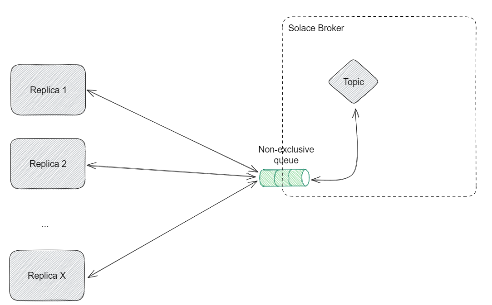
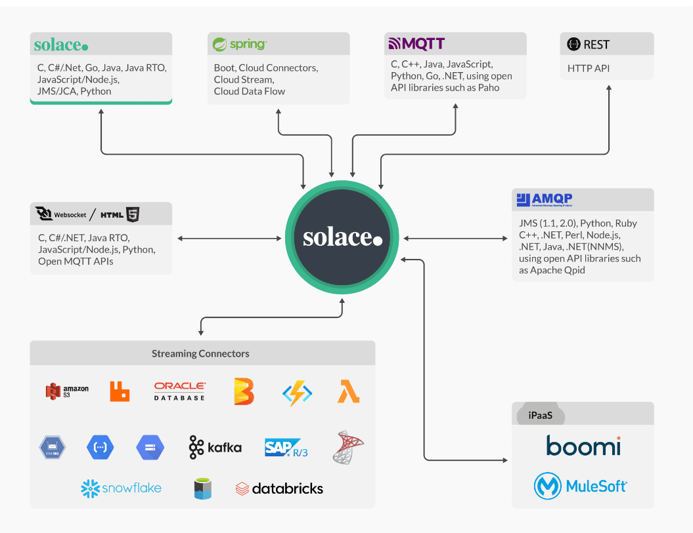

# SOLACE BROKER DEMO

This repo contains different examples of different approaches when trying to access Solace queues when our application runs in a k8s environment and we have multiple replicas. You can see each example in [this Configuration section](#choose-which-example-you-want-to-run).

## How to run the demo
First, you need to have all necessary components. In this case we're going to need a **Solace PubSub+** broker and an external **Redis database**. You can check both configured in the docker-compose.yaml file.

### Build & run containers
```
docker-compose up -d --build
```
Check that both containers initialize without problems. Once this step is completed, we will have to create the queues in Solace.
### Configure Solace queues

Go to _localhost:8080_ and login with 
- **user:** admin
- **password:** admin.

Once in the dashboard check if there's a message VPN created, if not create one with the defaults, and also name it "default":


Once a message VPN has been created, click on it. You will see a lot of information. Here you will have to go to "Queues" section in left menu & create 3 queues with the following names & config:
- **non-exclusive-queue:** With the option "Non-exclusive" enabled
- **exclusive-queue-1:** With the option "Exclusive" enabled
- **exclusive-queue-2:** With the option "Exclusive" enabled
You can ignore the rest of the options.
- 


Once this step is completed, you can start the demo.
### Choose which scenario you want to run

In this demo there's different examples/approaches that run under the same application, so it is important that **before running the application you define which case you want to run**.

This is possible by modifying some constants that are defined in the main method of this SpringBoot app, in **SolaceBrokerDemoApp**:

```
companion object Globals {
		//EXAMPLE 1: A single queue with 1 producer & 2 consumers
		const val isNonExclusiveExample = true

		//EXAMPLE 2: A queue for each consumer + locking following leader election pattern
		const val isLeaderElectionExample = false

		//Generic modifiers:
		const val publishRate: Long = 5000
		const val initialDelay: Long = 5000
	}
```

### Configure each scenario
You can enable/disable each example individually (or run both at the same time if you want to). It is also possible to change the rate at which messages are published so you can test each example under different loads.

#### Choose which example you want to run
- **isNonExclusiveExample:** This one will enable the demo where **two consumers are listening from the same non-exclusive queue**. You can clearly see how the Solace default round-robin scheduler works and how the message is processed only by one of the consumers:
```
Output example:
PUBLISHER 1 ==> PUBLISHED: Message 1
CONSUMER 1 ==> RECEIVED: Message 1

PUBLISHER 1 ==> PUBLISHED: Message 2
CONSUMER 2 ==> RECEIVED: Message 2

PUBLISHER 1 ==> PUBLISHED: Message 3
CONSUMER 1 ==> RECEIVED: Message 3

PUBLISHER 1 ==> PUBLISHED: Message 4
CONSUMER 2 ==> RECEIVED: Message 4
...
```


- **isLeaderElectionExample:** This one will enable the demo where we simulate **multiple queues subscribed to the same topic, each queue receiving the same message. We will have a single publisher and two consumers, each consumer listening from a different queue**. In addition we have implemented a **leader election pattern** using locks to organize the access to the queues. **PROBLEM:** As you will see in the example, this approach doesn't solve the duplication (or triplication, quadruplication, ... depending on the number of replicas of our app) that we have in the queues, as all of them will have the same messages. With the locking mechanism we organize when each replica reads from its queue, but not the contents of that queue, unfortunately processing each message twice (in this case is twice, but the message will be processed as many times as replicas/queues we have).
```
Output example:
PUBLISHER 1 ==> PUBLISHED: Message 1
CONSUMER 1 ==> Lock acquired
CONSUMER 1 ==> RECEIVED: Message 1
CONSUMER 2 ==> Cannot acquire lock because it is taken
CONSUMER 1 ==> Lock unlocked
CONSUMER 2 ==> Lock acquired
CONSUMER 2 ==> RECEIVED: Message 1
CONSUMER 2 ==> Lock unlocked
...
```

In that example you can clearly see how the lock mechanism works. We're even able to see that at some time CONSUMER 2 tried to take the lock, but was being used by CONSUMER 1 so it waits until the lock is unlocked to proceed with the consumption.

Also, as we mentioned, this pattern doesn't solve the reprocessing of messages problem, as each queue will have the same messages, we're only controlling when each consumer accesses its queue.


#### Tweak some generic modifiers
- **publishRate:** Rate at which the publisher (or publishers) throw a message to the queue(s).
- **initialDelay:** Initial delay for the publisher(s) to start generating messages


## Solace architecture & integrations


